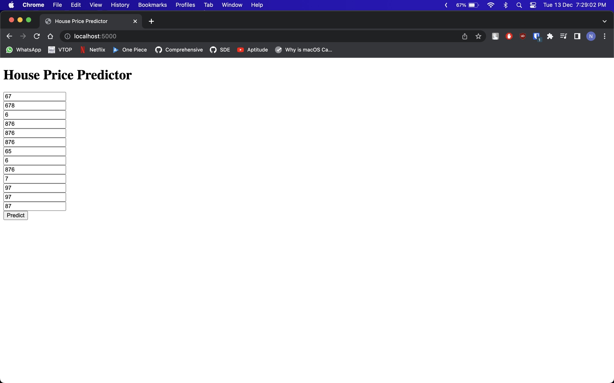
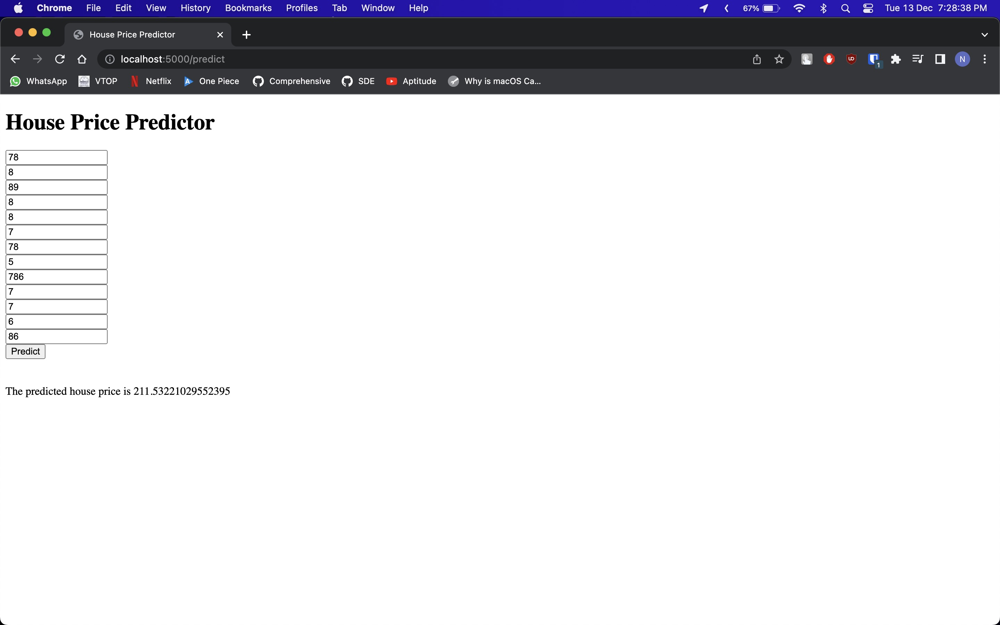

# Machine Learning - Linear Regression
## Boston House Sales Price Prediction 

### Description
* Implemented linear regression algorithm with gradient descent optimization to make an optimal model for predicting house prices using the Boston dataset.
* Performed feature engineering to eliminate features which had little or no impact on the residual sum of squares error.

### [Data](https://archive.ics.uci.edu/ml/machine-learning-databases/housing/)

### Programming Language
Python
Flask micro web framework

### Packages
- Flask
- scikit-learn
- numpy
- pandas
- matplotlib
- Git & GitHub

### Tools/IDE 
- Jupyter notebook (IPython)
- VS Code

### How to use it
1. Fork this repository to have your own copy
2. Clone your copy on your local system -> <br>
``` git clone https://github.com/N-liraj-khanna/Boston-House-Price-Predictor.git ```
3. Enter into the virtual enviroment -> <br>
``` conda activate venv/ ```
4. Install necessary packages -> <br>
``` conda install --file requirements.txt ```
5. Run the application -><br>
```flask run```


# 0. Introduction
This project focuses on building a web application to predict house prices for house buyers and house sellers.

The value of a house is more than just location and square footage. Houses have several features that make up it's value.We are going to take advantage of all the features to make accurate predictions about the price of any house.

We developed our application using a series of logical steps to ensure that users can easily use the application and make accurate predictions.

0) Introduction
1) Problem definition
2) Solution approach
3) Results and discussions
4) Conclusions
5) Refrences

# 1. Problem definition
We used a simple case study to understand the problem. There are two clients at the same time without a conflict of intreset.

The house buyer, a client that wants to buy their dream home. They have some locations in mind. Now, the client wants to know if the house price matches the value. With the application, they can understand which features are influence the final price. If the final price matches the value predicted by the application the can ensure they are getting a fair price.

The house seller, a client that buys houses, fixes them and then sells houses to make profit. This client wants to take advantage of features that influece the price of a house the most. They typically want to buy a house at a low price and invest in features that will give the highest return.

# 2. Solution approach

1) Define requirements
2) Gather data, analyze and build models
3) Build web backend API to use model
4) Design and develope frontend
7) Intergrate both frontend and backend
8) Test the entire application


## Define requirements
The requriements were gathered from the problem and formally defined.

### User function
* Predict house price
* Customize house parameters
* Assign unique label every prediction
* Save recent predictions

### Operating enviroment
* client/server system (Web)
* client: Web browers
* server: Python/Flask
* platform: Python/Javascript/HTML5/CSS3
* Operating system: Mac, Windows , Linux

## 2. Gather data, analyze and build models
Data was downloaded from [here](https://archive.ics.uci.edu/ml/machine-learning-databases/housing/)
We broke everything into the following steps
We started by loading data and packages we needed for the research.We then
analyzed the data to understand the relationships between the price and other
features. We cleaned the data and using some domain knowlegde replaced some
missing values. The next step was feature tranformation to make the data
compatible with our models. We then trained our model and started perfoming
some predictions.

## 3. Build web backend API to use model
Using python and the flask web framework we built a web API the takes advantage of our model.
The API comsumer can make a request containing JSON map of features and their values. The
flask server recieves this request and sends a response containing the predicted price.

## 6. Design and develope frontend
The User interface of the application was built using HTML, CSS3 and javascript.

## 7. Intergrate both frontend and backend
Using the javascript, we send data from the forms on the webpage to the flask server
and the server sends a reponse, which is a prediction of the price matching those features

## 8. Test the entire application
We run multiple tests fixed bugs in the code.

# 3. Results and discussions
## Screenshot of the application



We were able to build a web application that can predict the price of a house given certain features. The application runs in the browser and talks to a flask server that is taking data and passing it to a machine learning model.

# 4. Conclusion
There are real world problems that can be solved with machine learning. Some of these solutions can take real world data and make very accurate predictions that can be useful to our daily lives. Users can leverage the power of machine learning without being data scientist when easy to use applications are built around some of these complicated models.

# 5. Refrences

Understanding of the Dataset: [https://archive.ics.uci.edu/ml/machine-learning-databases/housing/](https://archive.ics.uci.edu/ml/machine-learning-databases/housing/) <br>
Video Reference: [https://www.youtube.com/watch?v=MJ1vWb1rGwM&list=PLZoTAELRMXVMdvxeSuliQZcRLu3WCYVim](https://www.youtube.com/watch?v=MJ1vWb1rGwM&list=PLZoTAELRMXVMdvxeSuliQZcRLu3WCYVim) <br>
Channel: [https://www.youtube.com/@krishnaik06](https://www.youtube.com/@krishnaik06)

## Author


👤 **N Liraj Khanna**

* Website: https://github.com/N-liraj-khanna
* Github: [@N-liraj-khanna](https://github.com/N-liraj-khanna)
* LinkedIn: [@https://www.linkedin.com/in/n-lirajkhanna/](https://www.linkedin.com/in/n-lirajkhanna/)

## 🤝 Contributing

Contributions, issues and feature requests are welcome!<br />Feel free to check [issues page](https://github.com/N-liraj-khanna/Boston-House-Price-Predictor/issues). You can also take a look at the [contributing guide](https://github.com/N-liraj-khanna/Boston-House-Price-Predictor/blob/master/CONTRIBUTING.md).

## Show your support

Give a ⭐️ if this project helped you!

## 📝 License

Copyright © 2021 [N Liraj Khanna](https://github.com/N-liraj-khanna).<br />
This project is [ISC](https://github.com/N-liraj-khanna/Boston-House-Price-Predictor/blob/master/LICENSE) licensed.